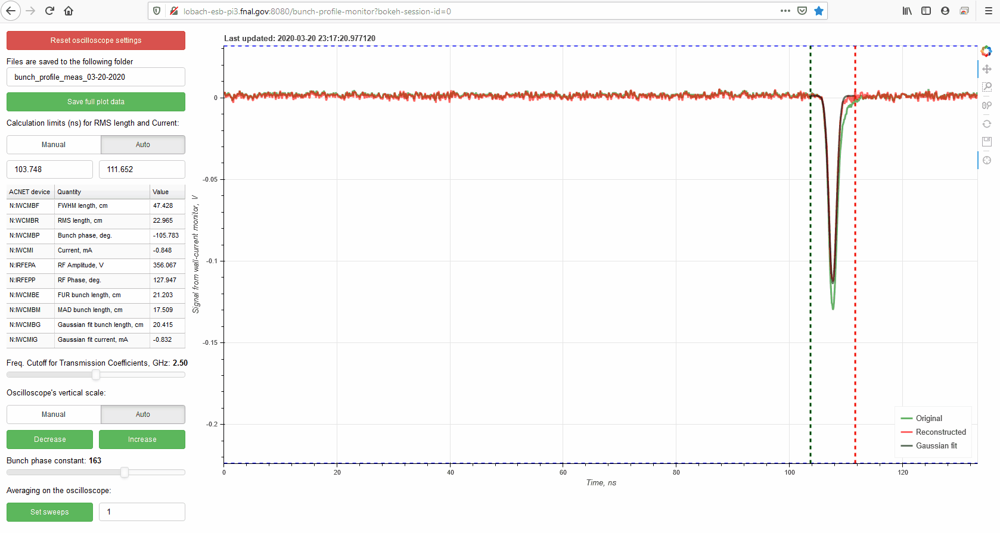

# bunch-profile-monitor
This web-server application is used at Fermilab's IOTA electron storage ring to measure the electron bunch's longitudinal profile and bunch length.

The program talks to an oscilloscope, to which the signal from the wall-current monitor (a device, measuring the bunch profile) is connected. Then, the signal from the scope is processed using FFT to account for transmission characteristics of the cables and the amplifier, located between the wall-current monitor and the oscilloscope. In this way, the initial signal from the wall-current monitor is reconstructed. Finally, RMS and FWHM bunch lengths are calculated based on the reconstructed bunch profile.

## Running the server locally with synthetic data
Tested on Ubuntu 18.04 LTS and Raspbian 10 (buster):
```
$ sudo apt install python3
$ sudo apt install python3-pip
$ pip3 install numpy scipy pandas matplotlib bokeh flask sqlite3
$ git clone https://github.com/IharLobach/bunch-profile-monitor.git
$ cd bunch-profile-monitor
$ mv config_raspberry_pi.json config.json
$ cd ..
$ python3 -m bokeh serve --address 0.0.0.0 --port 8080 --allow-websocket-origin 131.225.118.138:8080 --allow-websocket-origin lobach-esb-pi3:8080 --allow-websocket-origin localhost:8080  bunch-profile-monitor
```
A new tab should open in a browser window on the raspberry pi, and you will be able to open it anywhere else on the controls network by going to http://lobach-esb-pi3.fnal.gov:5000

131.225.118.138 is the raspberry pi's IP address, reaplace it accordingly, if you use a new raspberry pi.



The script `clx_udp_server_for_acnet.py` should be run on the linux cluster on the node clx60 for the values to be updated in ACNET. 

## Running the server locally with synthetic data
Replace the last 4 lines by
```
$ cd bunch-profile-monitor
$ mv config_localhost.json config.json
$ cd ..
$ python3 -m bokeh serve bunch-profile-monitor
```

Note that most of the buttons will cause errors in the program with synthetic data, because there is no connection to the oscilloscope in this configuration.
